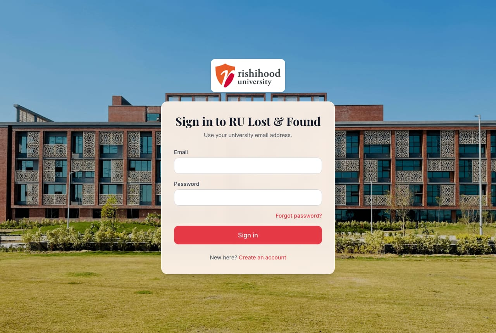
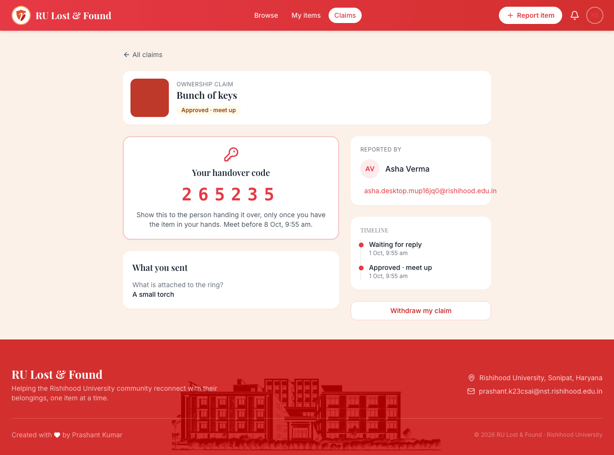
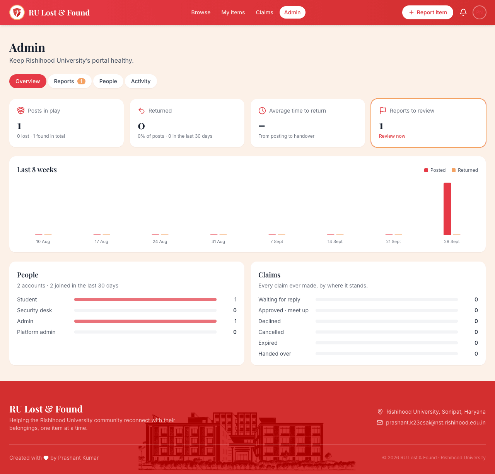
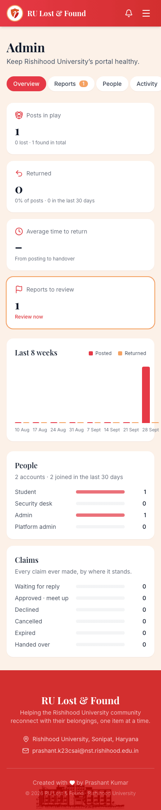
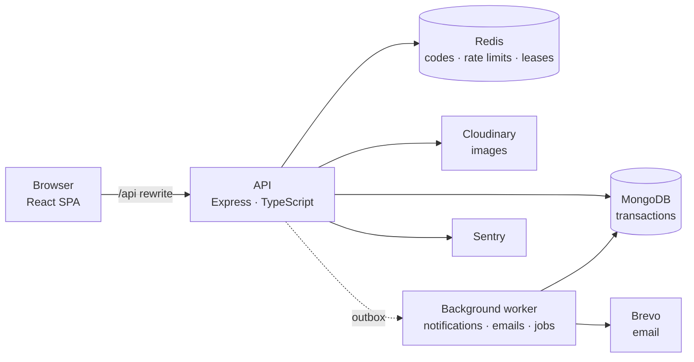

# RU Lost & Found

[](https://github.com/nox-pie/RU-Lost-Found/actions/workflows/ci.yml)


The lost & found portal of **Rishihood University**: students report what they lost or found, prove an item is theirs, and get it back through a verified handover, without sharing phone numbers with strangers.

**Live:** [ru-lost-found.vercel.app](https://ru-lost-found.vercel.app) · **API docs:** `/api/v1/docs` on the same domain

<p>
  
  
</p>
<p>
  
  
</p>

## How it works

1. **Report.** A student posts a lost or found item with photos, place and date. For found items, the finder can add questions only the owner could answer ("What's the wallpaper?").
2. **Claim.** The owner finds it by search or filters and claims it, answering the questions. The finder is notified in the app and by email.
3. **Decide.** The finder checks the answers and approves (or declines). Contact details are shared only now, and only with each other.
4. **Hand over.** They meet. The owner shows a 6-digit handover code; the finder enters it and the item is marked returned. Five wrong codes lock it, and the security desk can confirm in person instead.

Claims that never get handed over expire, other claims on the item close automatically, and everything is recorded in an audit log.

## Features

**For students:** sign-up verified by an emailed code (open to any email so visitors can try it; can be limited to university addresses by configuration) · search and filters · photo upload from phone or desktop · verification questions · in-app and email notifications · claim timeline · profile and picture · works on 360 px phones and up.

**For staff:** security-desk handover confirmation · admin dashboard (posts in play, return rate, average time to return, 8-week trend) · reports queue for flagged posts (remove with a reason, or keep) · people management (roles, suspension with immediate sign-out) · activity log in plain language.

**Under the hood:** rotating refresh tokens with theft detection · rate limits that work behind a campus-wide shared IP · images stripped of location data and re-encoded before storage · transactional outbox so no notification is lost · OpenAPI docs · error tracking · Docker images · re-brandable for other organisations through configuration.

## Architecture



A **modular monolith** in layers (route → controller → service → domain → repository), with a rich domain model: the claim lifecycle is a state machine (State pattern), aggregates guard their own rules and use optimistic concurrency, and side effects run through a **transactional outbox** (a change and its events are saved in one transaction; a worker delivers them at least once, with retries). Every external service sits behind an interface chosen in one composition root, so tests use in-memory fakes and each free-tier provider can be swapped for a paid one.

```text
apps/api          REST API (Express 5, Mongoose 9, Zod)          → docs/architecture/backend.md
apps/web          React 18 SPA (Vite, Tailwind, TanStack Query)  → docs/architecture/frontend.md
packages/shared   Zod schemas, enums and DTO types used by both, so client and server validate the same way
load              k6 load test                                    → docs/load-test.md
```

Design patterns and why each is there, security decisions, the data model and the API table are in the [backend design document](docs/architecture/backend.md).

## Quality

| | |
|---|---|
| **Tests** | 354 API tests (domain unit tests, integration tests on a real in-memory MongoDB replica set, HTTP tests through the real app) with enforced coverage (≈95% of statements); 7 Playwright tests in a real browser on desktop and a phone, including the full handover, the moderation flow and a sleeping server |
| **Load** | 200 simultaneous users on one instance: 95% of reads under 9 ms, writes under 36 ms, zero errors. Up to 1,000 simultaneous users (360 requests/s) without a single failed request. [Details](docs/load-test.md) |
| **Security** | Independent review with every finding fixed; strict content security policy; no personal data in logs or error reports. [Details](docs/architecture/backend.md#9-authentication-and-security) |
| **CI** | Typecheck, lint, formatting, tests with coverage, builds, end-to-end tests and Docker image builds on every push |

## Tech stack

| Area | Choices |
|---|---|
| Web | React 18, TypeScript, Vite, Tailwind CSS, React Router, TanStack Query, React Hook Form + Zod |
| API | Node.js 22, Express 5, TypeScript, Mongoose 9, Zod, pino, sharp, JWT, bcrypt |
| Data | MongoDB Atlas (transactions), Upstash Redis |
| Services | Cloudinary (images), Brevo (email), Sentry (errors), UptimeRobot (uptime) |
| Delivery | Vercel (web), Render (API, Docker), GitHub Actions |
| Testing | Vitest, Supertest, mongodb-memory-server, Playwright, k6 |

## Running it locally

**Everything in Docker** (needs Docker only):

```bash
docker compose up --build        # → http://localhost:8080 · API docs at /api/v1/docs
docker compose logs api          # sign-up codes are printed here
```

**For development** (Node 22, plus Docker for MongoDB):

```bash
npm ci
docker run -d --name rlf-mongo -p 27017:27017 mongo:7 --replSet rs0
docker exec rlf-mongo mongosh --quiet --eval "rs.initiate({ _id: 'rs0', members: [{ _id: 0, host: '127.0.0.1:27017' }] })"
cp apps/api/.env.example apps/api/.env     # works as is for local development
npm run seed -w @ru-lost-found/api         # creates (or updates) the university
npm run dev:api                            # http://localhost:5001 (sign-up codes appear in this log)
npm run dev:web                            # http://localhost:5173
npm run set-role -w @ru-lost-found/api -- you@rishihood.edu.in UNIVERSITY_ADMIN   # after signing up
```

| Command | Does |
|---|---|
| `npm run check` | Typecheck, lint, formatting and all tests with coverage |
| `npm run e2e` | Playwright journeys (starts its own database, API and web app) |
| `npm run build` | Production builds of the API and the web app |

## Documentation

- [Backend design](docs/architecture/backend.md): architecture, domain model, claim state machine, outbox, security, API, patterns, testing
- [Frontend design](docs/architecture/frontend.md): structure, sessions, data layer, screens, accessibility
- [Deployment runbook](docs/deployment.md): production setup, switch-over and rollback, free-tier limits
- [Load test](docs/load-test.md): method, results, and the bottleneck it found
- [Branding](docs/branding.md): running the portal for another organisation

## For other organisations

The portal is built for Rishihood University. Its name, logo, colours, email domains and departments are configuration, so another organisation can have its own deployment without code changes. Running it requires a licence: contact the author.

## Author

**Prashant Kumar** · Rishihood University · [prashant.k23csai@nst.rishihood.edu.in](mailto:prashant.k23csai@nst.rishihood.edu.in)

## License

Copyright © Prashant Kumar. **All rights reserved.** The source is visible for review and evaluation only; see [LICENSE](LICENSE).
