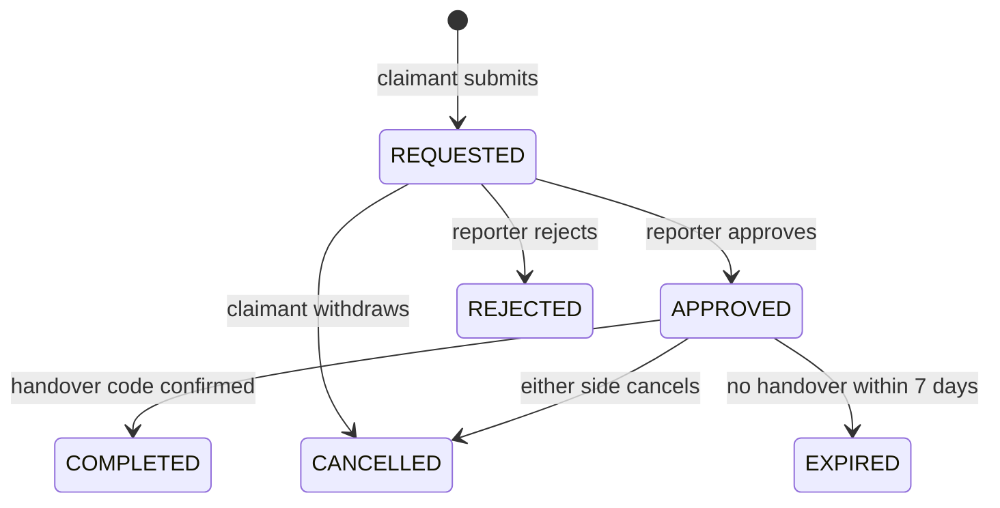

# ADR 0009: The claim lifecycle as a state machine (State pattern)

- **Status:** Accepted
- **Date:** 1 October 2026 (the rebuild)

## Context

A claim is the heart of the product: it connects the person who reported an item with the person who claims it, and moves through `REQUESTED → APPROVED → COMPLETED`, or ends as `REJECTED`, `CANCELLED` or `EXPIRED`. Each action is legal only in some statuses (you can't approve a completed claim, or complete a rejected one), and each transition has side effects on the item (reserve, reopen, resolve). In the first version the status was a plain string field changed by controllers with scattered `if` checks.

## Decision

Model the lifecycle with the **State pattern**:

- `ClaimState` (abstract) declares every action: `approve()`, `reject()`, `cancel()`, `completeHandover()`, `expire()`. The base implementation **throws `InvalidStateTransitionError`**; each concrete state overrides only the actions it allows and returns the next status.
- `RequestedState`, `ApprovedState` and a shared `TerminalState` (for the four end statuses) are the concrete states. They hold no per-claim data, so one instance per status is shared (**Flyweight**).
- The `Claim` aggregate asks its current state for the next status, applies it, appends the transition to `history` (from, to, by, at) and records the matching domain event (`ClaimApproved` …).
- Rules around the transitions (only the reporter decides, five wrong handover codes lock the code, a deadline of 7 days) live in `Claim`; which transitions exist lives in the states. Side effects on other aggregates (the item, other claims) happen in `ClaimService` inside one unit of work.

## Alternatives considered

| Option                                                    | Why not                                                                                                                                                          |
| --------------------------------------------------------- | ---------------------------------------------------------------------------------------------------------------------------------------------------------------- |
| **Status string + `if`/`switch` in each method**          | Every method repeats "is this allowed from here?"; adding a status means editing all of them, and one forgotten check is a bug.                                  |
| **A transition table** (`{ REQUESTED: ['APPROVED', …] }`) | Compact and also valid; but actions carry different arguments and guards, and a table makes "which action leads where" less explicit than one method per action. |
| **A state-machine library (XState)**                      | Powerful, but a heavy dependency and its own DSL for six statuses and five actions.                                                                              |

## Consequences

**Good**

- Illegal transitions fail in one place with one error type (HTTP 409 `INVALID_STATE_TRANSITION`).
- A new status (e.g. `DISPUTED`) is a new state class plus the overrides that lead to it, not an edit to every method (Open/Closed).
- The whole lifecycle is unit-tested without a database (`Claim.test.ts`).

**Bad / accepted**

- More classes than a `switch`; the diagram above (also in `backend.md`) is needed to see the whole machine at a glance.
- Concurrency still has to be handled outside the pattern: optimistic versions and partial unique indexes ([ADR 0005](0005-mongodb-with-transactions.md)).

## In the code

`apps/api/src/modules/claims/domain/ClaimState.ts`, `Claim.ts`, `claim.service.ts`, [backend.md §6](../architecture/backend.md#6-claim-workflow-state-pattern).
