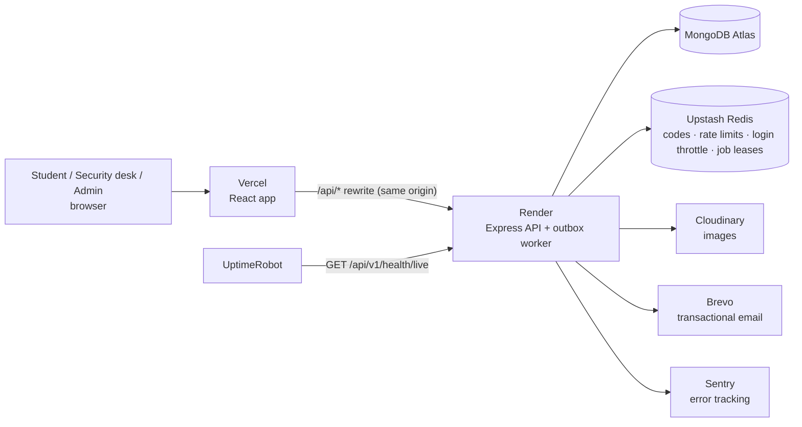
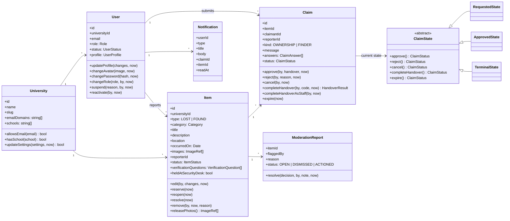
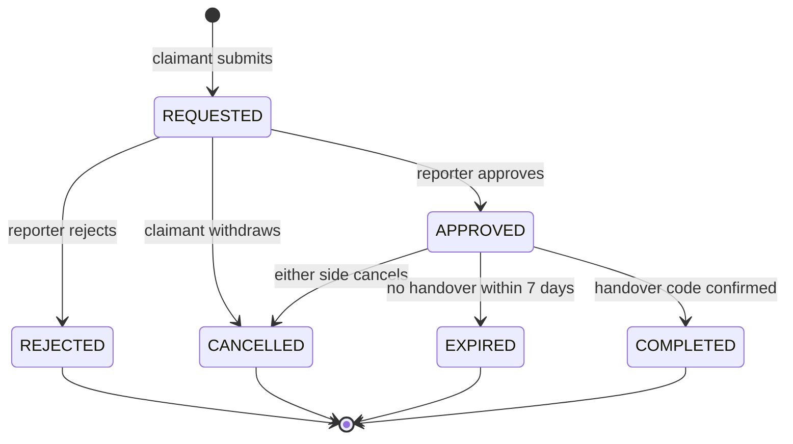
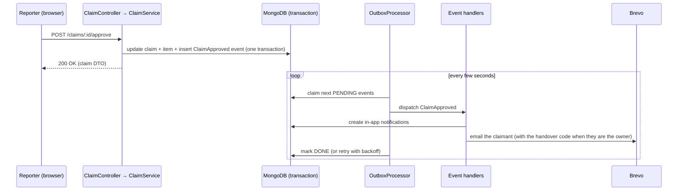

# Backend Architecture

Status: Built and live · Last updated: 2 October 2026

The backend is a **modular monolith** written in TypeScript on Node.js and Express 5. Each business capability lives in its own module. Business modules (auth, users, items, claims, moderation, notifications) are split into the same layers: routes, controller, service, repository and domain; small modules (health, audit, universities) have only the layers they need. Infrastructure (MongoDB, Redis, Cloudinary, email) sits behind interfaces, so any provider can be swapped without touching business logic.

---

## 1. Architectural style

**Decision: modular monolith, not microservices.**

| Option                                      | Why not / why                                                                                                                                                                      |
| ------------------------------------------- | ---------------------------------------------------------------------------------------------------------------------------------------------------------------------------------- |
| Microservices                               | One developer, low traffic, free hosting with one server. Network calls, distributed transactions and multiple deployments would add cost with no benefit.                         |
| Plain MVC (the first version, now replaced) | Controllers mixed HTTP, business rules, database access and email. Hard to test and hard to change.                                                                                |
| **Modular monolith (chosen)**               | One deployable app, but modules have strict boundaries and talk only through services and domain events. Any module can be extracted into its own service later without a rewrite. |

**Layer rules** (dependencies point inwards only):

```
Route → Controller → Service → Repository (interface) → Mongoose model
                        ↓
                  Domain entity (pure business rules, no framework imports)
```

| Layer          | Responsibility                                                                                                            | Must not                                                     |
| -------------- | ------------------------------------------------------------------------------------------------------------------------- | ------------------------------------------------------------ |
| Route          | Map URL + method to a controller; attach middleware (auth, validation, rate limit)                                        | Contain logic                                                |
| Controller     | Read the validated request, call one service method, map the result to a response DTO                                     | Touch the database or business rules                         |
| Service        | Orchestrate a use case: load entities, call domain methods, save (the repository stores the events the entities recorded) | Know about HTTP (`req`, `res`)                               |
| Domain entity  | Hold state and enforce invariants (e.g. a claim can only be approved while requested)                                     | Import Express, Mongoose or any SDK                          |
| Repository     | Load and save entities; map between Mongoose documents and domain entities                                                | Contain business rules                                       |
| Infrastructure | Implement interfaces for external systems (Redis, Cloudinary, Brevo)                                                      | Be imported directly by services (only their interfaces are) |

---

## 2. System context



Because Vercel rewrites `/api/*` to Render, the browser sees one origin. This lets the refresh token live in a secure `httpOnly` cookie without cross-site cookie problems.

---

## 3. Repository and folder structure

```
ru-lost-found/
├── apps/
│   ├── api/                      # TypeScript backend (this document)
│   └── web/                      # React frontend
├── packages/
│   └── shared/                   # Zod schemas, enums and DTO types used by both apps
├── docs/
│   ├── architecture/             # backend.md (this document), frontend.md
│   ├── deployment.md · load-test.md · branding.md
│   └── screenshots/
├── load/                         # k6 load test
├── .github/workflows/            # CI pipeline
└── package.json                  # npm workspaces root
```

```
apps/api/src/
├── main.ts                       # Bootstrap: load config, build container, start HTTP server + worker
├── worker.ts                     # The background worker alone (when run as a separate process)
├── app.ts                        # createApp(container): Express app with middleware and routes
├── container.ts                  # Composition root: the ONE place where concrete classes are created
├── config/env.ts                 # Environment variables validated with Zod at startup
├── core/                         # Shared kernel: interfaces and helpers, no business logic
│   ├── domain/                   # AggregateRoot, Actor (roles), Clock, IdGenerator, ImageRef
│   ├── errors/                   # AppError hierarchy
│   ├── http/                     # authenticate / authorize / authorizeCurrent, rate limiter, middleware/
│   │                             #   (requestLogger, security, validate, imageUpload, concurrencyLimit, errorHandler)
│   ├── events/                   # DomainEvent, EventHandler, EventHandlerRegistry
│   ├── persistence/              # Repository, TenantScope, UnitOfWork, cursor Pagination
│   ├── audit/ · cache/ · email/ · health/ · observability/ · security/ · storage/   # ports (interfaces)
│   └── logger/                   # pino logger (redacts credentials)
├── infrastructure/               # Adapters that implement the ports
│   ├── database/                 # MongoDatabase, MongoUnitOfWork, MongoRepository base (+ OutboxWriter), schemas
│   ├── cache/                    # RedisKeyValueStore, InMemoryKeyValueStore
│   ├── storage/                  # CloudinaryStorageProvider, LocalDiskStorageProvider,
│   │                             #   SanitizingStorageProvider (decorator), SharpImageProcessor
│   ├── email/                    # BrevoEmailSender, ConsoleEmailSender, FileEmailSender
│   ├── security/                 # BcryptPasswordHasher, JwtTokenService, keys (HKDF)
│   ├── outbox/                   # MongoOutbox, OutboxProcessor
│   ├── worker/                   # BackgroundWorker, JobScheduler
│   └── observability/            # SentryErrorReporter
├── modules/
│   ├── auth/                     # Codes, register, login, refresh, logout, password reset
│   ├── users/                    # Profile, avatar, RolePolicy, AdminAccounts (ADMIN_EMAILS)
│   ├── universities/             # Tenants: each university's email domains and school list
│   ├── items/                    # Lost/found reports, search
│   ├── claims/                   # Claim workflow (state machine)
│   ├── notifications/            # In-app notifications + email handlers
│   ├── moderation/               # Flagging posts, admin review
│   ├── admin/                    # Stats (read model), people management, activity log
│   ├── audit/                    # Audit log (audit_logs) and the handler that fills it
│   └── health/                   # live / ready / client checks
├── docs/                         # OpenAPI document and Swagger UI
├── scripts/                      # seed, set-role, migrate-legacy
└── testing/                      # Test helpers: test app, builders, fakes
```

Business modules follow the same internal layout:

```
modules/claims/
├── domain/                       # Pure business rules: no Express, Mongoose or SDK imports
│   ├── Claim.ts                  # Entity: submit(), approve(), reject(), cancel(), completeHandover(), expire()
│   ├── ClaimState.ts             # State pattern: RequestedState, ApprovedState, TerminalState
│   ├── ClaimRepository.ts        # Repository interface (owned by the domain)
│   └── errors.ts                 # HandoverCodeIncorrectError, HandoverLockedError
├── infrastructure/
│   └── MongoClaimRepository.ts   # Mongoose schema + indexes + entity ↔ document mapping
├── claim.service.ts              # Use cases
├── claim.controller.ts
├── claim.routes.ts
├── claim.mapper.ts               # Entity → response DTO (never leaks internal fields)
├── handlers/                     # Reactions to other modules' events (CloseClaimsOnItemRemoved)
└── *.test.ts                     # Tests sit next to the code they test
```

---

## 4. Core abstractions (Dependency Inversion)

Services depend on these interfaces, never on concrete SDKs. Interfaces have plain names (`UserRepository`); implementations say what they are built on (`MongoUserRepository`). Each has a production implementation and a lightweight one for local development and tests.

| Interface                                                | Production                                                     | Dev / test                                                                    | Used for                                                |
| -------------------------------------------------------- | -------------------------------------------------------------- | ----------------------------------------------------------------------------- | ------------------------------------------------------- |
| `UserRepository`, `ItemRepository`, `ClaimRepository`, … | `Mongo*Repository`                                             | `Mongo*` on mongodb-memory-server                                             | Persistence                                             |
| `UnitOfWork`                                             | `MongoUnitOfWork` (session + transaction)                      | same                                                                          | Atomic multi-document writes                            |
| `OutboxWriter`                                           | `MongoOutbox`                                                  | same                                                                          | Storing domain events in the aggregate's transaction    |
| `EventHandler` (+ `EventHandlerRegistry`)                | notification, audit and claims handlers                        | same                                                                          | Reacting to events (delivered by `OutboxProcessor`)     |
| `KeyValueStore`                                          | `RedisKeyValueStore` (Upstash)                                 | `InMemoryKeyValueStore`                                                       | One-time codes, rate limits, login throttle, job leases |
| `StorageProvider`                                        | `SanitizingStorageProvider` around `CloudinaryStorageProvider` | `LocalDiskStorageProvider` (dev), `InMemoryStorageProvider` (tests)           | Image upload and delete                                 |
| `ImageSanitizer`                                         | `SharpImageProcessor`                                          | same                                                                          | Strip metadata, resize, re-encode                       |
| `EmailSender`                                            | `BrevoEmailSender`                                             | `ConsoleEmailSender`, `FileEmailSender` (e2e), `CapturingEmailSender` (tests) | Sending email                                           |
| `PasswordHasher`                                         | `BcryptPasswordHasher` (native bcrypt)                         | same                                                                          | Hashing passwords                                       |
| `IdGenerator`                                            | `ObjectIdGenerator`                                            | same                                                                          | Ids for new aggregates before they are saved            |
| `TokenService`                                           | `JwtTokenService`                                              | same                                                                          | Access and verification tokens                          |
| `AuditTrail` / `AuditLog`                                | `MongoAuditTrail`                                              | same                                                                          | Writing and reading the audit log                       |
| `StatsReader`                                            | `MongoStatsReader`                                             | same                                                                          | Admin dashboard (read model)                            |
| `HealthIndicator`                                        | `MongoDatabase`, `RedisKeyValueStore`                          | `FakeHealthIndicator` (tests)                                                 | Readiness checks                                        |
| `ErrorReporter`                                          | `SentryErrorReporter`                                          | `noErrorReporting`, `RecordingErrorReporter` (tests)                          | Error tracking                                          |
| `Clock`                                                  | `SystemClock`                                                  | `FixedClock`                                                                  | Testable time (code expiry, claim deadlines)            |

**Dependency injection:** constructor injection, wired by hand in `container.ts`. No DI library: the wiring stays visible and easy to explain, and switching a provider is a one-line change there.

```ts
// container.ts (excerpt)
keyValueStore: infra.redis ?? new InMemoryKeyValueStore(clock),   // Redis is connected in main.ts
emailSender: env.BREVO_API_KEY
  ? new BrevoEmailSender(env.BREVO_API_KEY, { address: env.EMAIL_FROM_ADDRESS, name })
  : env.DEV_EMAIL_DIR
    ? new FileEmailSender(env.DEV_EMAIL_DIR)
    : new ConsoleEmailSender(logger),

const claimService = new ClaimService({
  claims, items, users, unitOfWork, ids, clock,
  generateHandoverCode: () => generateNumericCode(6),
  logger, audit,
});
```

---

## 5. Domain model



Each claim status maps to one shared, stateless state object (`RequestedState`, `ApprovedState`, `TerminalState`; Flyweight). A state answers "what status does this action lead to?" and throws for actions that aren't allowed, so the legal transitions live in one place.

**Enumerations**

| Enum          | Values                                                                                                   |
| ------------- | -------------------------------------------------------------------------------------------------------- |
| `Role`        | `STUDENT`, `SECURITY_DESK`, `UNIVERSITY_ADMIN`, `PLATFORM_ADMIN`                                         |
| `ItemStatus`  | `OPEN`, `RESERVED` (a claim is approved, awaiting handover), `RESOLVED`, `REMOVED`                       |
| `ClaimStatus` | `REQUESTED`, `APPROVED`, `REJECTED`, `CANCELLED`, `EXPIRED`, `COMPLETED`                                 |
| `Category`    | `ELECTRONICS`, `ID_CARD`, `KEYS`, `WALLET`, `BAG`, `CLOTHING`, `BOOKS`, `BOTTLE`, `ACCESSORIES`, `OTHER` |

**University vs school:** a _University_ is a customer of the platform (a tenant), for example Rishihood University. _Schools_ such as Newton School of Technology or School of Entrepreneurship are departments inside one university. They are stored as a list on the university and shown in the sign-up form; a user's school is just a profile field and does not separate any data.

**Deployment model:** the code is multi-tenant (every query is scoped by `universityId`), but each organisation gets its **own branded deployment**: this one serves Rishihood University only. A deployment's universities come from `apps/api/seed/universities.json`, and its email branding from `BRAND_NAME`, `BRAND_PRIMARY_COLOR` and `BRAND_BACKGROUND_COLOR` (injected into `EmailLayout`, which `AuthEmails` and `NotificationEmails` build on). See [../branding.md](../branding.md).

**Roles:** `STUDENT` < `SECURITY_DESK` < `UNIVERSITY_ADMIN` < `PLATFORM_ADMIN`. Admins manage only people ranked below them (never themselves or a fellow admin, so nobody can lock themselves out or remove a peer) and may give roles up to their own rank. Every role change, suspension and reactivation is a domain event, so it lands in the audit log. The deployment's owners are listed in the `ADMIN_EMAILS` setting and made platform admins automatically (at startup, or when they sign up); `npm run set-role -- <email> <ROLE>` remains for one-off changes. Admin routes re-read the user's role and status from the database on each request (`authorizeCurrent`), so a demoted or suspended admin loses access at once instead of when the 15-minute access token expires; ordinary routes trust the token, and a suspended student's sessions are ended immediately.

**Moderation:** anyone can flag a post (`ModerationReport`: reason, details; one per person per post). An admin decides on all open reports for a post at once: removing it is one transaction (item `REMOVED` + reports `ACTIONED`); its open claims are then closed by `CloseClaimsOnItemRemoved` and the poster is told why by `ItemModerationHandler`.

**Other collections:** `sessions` (refresh tokens), `outbox_events`, `audit_logs`, `moderation_reports`.

---

## 6. Claim workflow (State pattern)

A **claim** connects the item's reporter with another user:

- On a **FOUND** item, the claimant says "this is mine" (`OWNERSHIP`) and answers the reporter's verification questions.
- On a **LOST** item, the claimant says "I found this" (`FINDER`) and describes where it is.



**Rules**

1. A user can't claim their own item and can have only one active claim per item (enforced by a partial unique index). Once the reporter rejects someone's claim on an item, that person can't claim it again (no repeated pestering); withdrawing your own claim doesn't block you.
2. Approving a claim sets the item to `RESERVED`. Only one claim per item can be `APPROVED` at a time.
3. On approval, the system generates a 6-digit **handover code** and gives it to the item's owner:
   - the claimant for a FOUND item;
   - the reporter for a LOST item.

   The person handing over the item enters the code when they meet. The code is stored readable so the owner can view it in the app, but it is only ever shown to the owner; entry is limited to 5 attempts and must happen before the deadline. A wrong code is counted and saved, not thrown, so attempts can't be reset by retrying. When the code is locked, security desk staff confirm the handover in person.

4. `COMPLETED` sets the item to `RESOLVED` and automatically rejects all other open claims on it.
5. `CANCELLED` or `EXPIRED` after approval puts the item back to `OPEN`.
6. Every transition is appended to the claim's `history` (from, to, by, at) and written to the audit log.
7. **Privacy:** before approval each side sees only the other's name and picture. After approval, the two people (never outsiders or staff) see each other's email, and a phone number only if its owner chose `sharePhone`. The handover code is only ever sent to the item's owner.
8. Removing an item cancels its active claims; an expiry job ends approved claims whose deadline passed and reopens their items.

**Why the State pattern:** each state class decides which transitions are legal. An illegal action, such as approving a completed claim, throws `InvalidStateTransitionError` from one place instead of scattered `if` checks. A new state (e.g. `DISPUTED`) is a new class, not an edit to every method (Open/Closed principle).

**Concurrency** is protected at three levels:

1. **Transactions:** claim, item and outbox writes for one action run in one MongoDB transaction via `UnitOfWork` (the driver's `withTransaction`, which retries transient write conflicts).
2. **Optimistic concurrency:** every document has a `version`. An update only matches the version that was loaded, otherwise it fails with `ConcurrencyError` (HTTP 409) instead of silently overwriting someone else's change.
3. **Unique partial indexes** as a last line of defence: at most one active claim per person per item (`uniq_active_claim_per_claimant`) and at most one approved claim per item (`uniq_approved_claim_per_item`).

---

## 7. Events, notifications and the outbox

Use cases never send notification emails themselves. (The one exception: sign-up and password-reset codes, which `AuthService` sends straight away in the background, because they must arrive at once and the code must never be stored.) Aggregates record **domain events** while their business methods run (`ClaimApproved`, `ItemRemoved`, …). When a repository saves an aggregate, the `MongoRepository` base class writes its pending events to the `outbox_events` collection **in the same transaction** (the caller's, or one it starts itself). No service can forget to publish an event, and an event never exists without its change. A background worker then delivers the events.



**Why:** in the first version the email was sent _before_ the database update, so a failure left the two out of sync. With the outbox, the event is saved exactly when the change is.

**Delivery guarantees (at least once):**

- **Claiming:** a worker takes one event at a time with an atomic `findOneAndUpdate` and a 60-second lease. With several instances each event goes to exactly one; an event whose worker crashed is taken over when the lease runs out.
- **Per-handler progress:** each handler's success is recorded on the event (`completedHandlers`), so a retry only re-runs the handlers that failed. A healthy email is not re-sent because another handler failed.
- **Retries:** exponential back-off (30 s, 1 min, 2 min, 4 min); after 5 attempts the event is marked `FAILED` and kept for inspection.
- **Idempotent handlers:** in-app notifications have a unique index on (event id, recipient), so even a redelivered event can't notify anyone twice.
- **Housekeeping:** delivered events are deleted after 7 days; notifications after 180 days (TTL index).

**Observer pattern:** handlers subscribe to event types through the `EventHandlerRegistry`. Adding a new reaction, such as push notifications, means adding a handler; the module that raised the event doesn't change.

| Handler                    | Reacts to                                                                          | Does                                                                                                                                                                          |
| -------------------------- | ---------------------------------------------------------------------------------- | ----------------------------------------------------------------------------------------------------------------------------------------------------------------------------- |
| `ClaimNotificationHandler` | `ClaimRequested`, `…Approved`, `…Rejected`, `…Cancelled`, `…Completed`, `…Expired` | In-app notification to the right person; email for steps that need action (a new claim, approval with the handover code, a manual rejection, a cancelled or expired handover) |
| `AccountSecurityHandler`   | `PasswordChanged`, `UserSuspended`, `UserReactivated`                              | Account emails: "if this wasn't you…", the suspension reason, "you can sign in again"                                                                                         |
| `CloseClaimsOnItemRemoved` | `ItemRemoved`                                                                      | Cancels the item's active claims. The items module never calls the claims module directly: modules stay decoupled                                                             |
| `AuditEventHandler`        | Account, item, claim, role and moderation events                                   | Writes the matching `audit_logs` entry (idempotent: one entry per event)                                                                                                      |
| `ItemModerationHandler`    | `ItemRemoved` (by an admin)                                                        | Tells the poster their post was removed, with the admin's reason (in the app and by email)                                                                                    |

**Scheduled jobs**, run by the same worker. A lease in the shared key-value store (Redis) makes each job run on only one instance per interval:

| Job                         | Every  | Does                                                                                                     |
| --------------------------- | ------ | -------------------------------------------------------------------------------------------------------- |
| `expire-claims`             | 5 min  | Expires approved claims past their handover deadline and reopens their items (one transaction per claim) |
| `purge-removed-item-photos` | 1 hour | Deletes photos of items removed more than 30 days ago (the moderation window)                            |
| `prune-outbox`              | 1 day  | Deletes delivered events older than 7 days                                                               |

The worker runs inside the API process on the free tier (`WORKER_ENABLED=true`). On a paid plan it becomes a separate process (`npm run start:worker`, API with `WORKER_ENABLED=false`) with no code change.

---

## 8. Matching (planned, not built yet)

Designed for the next milestone: when an item is reported (the `ItemReported` event already exists), a `MatchingService` handler would search open items of the **opposite type** at the same university, in the same category, reported within ±14 days, and score them with a `MatchScorer` (Strategy pattern). Matches above a threshold would be saved as suggestions, and the owner of the lost item notified.

- First scorer: MongoDB text score on title, description and location, plus category and date proximity.
- Later: an image-similarity or embedding-based scorer implements the same interface; nothing else changes.

Today only `AuditEventHandler` reacts to `ItemReported`.

---

## 9. Authentication and security

| Concern                    | Design                                                                                                                                                                                                                                                                                                                                                                                                                                                                                                                                                                                                       |
| -------------------------- | ------------------------------------------------------------------------------------------------------------------------------------------------------------------------------------------------------------------------------------------------------------------------------------------------------------------------------------------------------------------------------------------------------------------------------------------------------------------------------------------------------------------------------------------------------------------------------------------------------------ |
| Sign-up                    | Email must match a university's `emailDomains` (subdomains included). `"*"` in the list opens sign-up to any address, used now so visitors can try the portal; an exact domain match always wins over `"*"`. The emailed code still proves every address is real. Two steps: a one-time code proves the email (→ 30-minute verification token), then the account is created with that token.                                                                                                                                                                                                                 |
| One-time codes             | 6 digits from a cryptographic RNG. Only an HMAC is stored (Redis, 10-minute TTL), 5 guesses per code, deleted after use, one new code per minute per email, and at most 10 wrong codes per email per day across all codes (asking for fresh codes can't speed up guessing).                                                                                                                                                                                                                                                                                                                                  |
| Secrets                    | One `APP_SECRET`; independent keys for access tokens, verification tokens and code hashing are derived from it with HKDF.                                                                                                                                                                                                                                                                                                                                                                                                                                                                                    |
| Account enumeration        | Code requests answer the same for known and unknown emails (an existing account gets a "you already have an account" email instead of a code), and code emails are sent in the background so response times match too. Login returns one message for a wrong email or password and hashes a dummy password for unknown emails so timing matches.                                                                                                                                                                                                                                                             |
| Password reset             | The verification token carries a fingerprint of the current password hash, so it stops working once the password changes (single use). Resetting ends every session.                                                                                                                                                                                                                                                                                                                                                                                                                                         |
| Passwords                  | bcrypt; minimum 8 characters, at least one letter and one number.                                                                                                                                                                                                                                                                                                                                                                                                                                                                                                                                            |
| Access token               | JWT (HS256), 15 minutes, payload `{ sub, uid (university id), role }`, sent as `Authorization: Bearer`; the frontend keeps it in memory only.                                                                                                                                                                                                                                                                                                                                                                                                                                                                |
| Refresh token              | Random 256-bit value in an `httpOnly`, `Secure` (in production), `SameSite=Lax` cookie (7 days) sent only to `/api/v1/auth`, stored as a SHA-256 hash in `sessions` (MongoDB deletes expired ones via a TTL index). **Rotated on every use**; replaying an old _rotated_ token ends the whole session family (theft detection; tokens ended by sign-out, a password change or a suspension are simply refused), except within 30 seconds of rotation, which is treated as two tabs racing. _Accepted trade-off:_ a thief who rotates first and a victim who replays within those 30 seconds is not detected. |
| Authorization              | `authorize(...roles)` middleware for roles (admin routes use `authorizeCurrent`, which re-reads the role from the database), plus ownership and role rules in the domain (e.g. only the reporter approves claims; `RolePolicy` for who may manage whom).                                                                                                                                                                                                                                                                                                                                                     |
| Multi-university isolation | Every tenant-owned repository method (items, claims, reports, audit log, stats) takes a `TenantScope` built from the token's university, so such a query can't be written without it. Users are looked up by id or email (emails are unique platform-wide) and checked against the scope in the service; notifications belong to one user.                                                                                                                                                                                                                                                                   |
| Rate limiting              | Redis-backed. Per-IP limits are generous because a whole campus may share one IP (NAT); tight limits are per email or account: code requests, failed logins (10 per account and IP per 15 min, 50 per account per hour, only failures count so nobody can lock someone else out), 20 item reports and 20 avatar uploads per user per day. A general cap of 120 writes per IP per minute; reads aren't counted because each check costs a Redis command on the metered free tier.                                                                                                                             |
| Client IP                  | `TRUST_PROXY_HOPS` tells Express how many proxies sit in front of the app. Measured in production with `GET /health/client`: visitor → Vercel → Cloudflare → Render's load balancer → app, so **4**. It must be set explicitly in production: too low and all users share one rate-limit bucket, too high and clients can fake their IP. Trade-off: someone calling Render directly (bypassing Vercel) passes one hop fewer and could fake their address, dodging the per-IP limits only; the tight limits are per email and per account, which a fake IP doesn't affect.                                    |
| Uploads                    | Type checked from file bytes, then **every image is re-encoded** (`SanitizingStorageProvider` decorator + sharp): metadata such as GPS location is removed, orientation applied, resized to ≤ 2000 px, stored as WebP. Decompression bombs (> 40 MP) are refused before decoding. At most 4 uploads are processed at once per instance (503 + `Retry-After` beyond that) so parallel uploads can't exhaust memory.                                                                                                                                                                                           |
| HTTP headers               | JSON-only API: `Content-Security-Policy: default-src 'none'; frame-ancestors 'none'`, `Cross-Origin-Resource-Policy: same-site`, `Referrer-Policy: no-referrer`, `Cache-Control: no-store` on every response (personal data), HSTS and the other helmet defaults.                                                                                                                                                                                                                                                                                                                                            |
| CSRF                       | The refresh and logout endpoints are the only ones authenticated by a cookie. Protected by SameSite=Lax **and** an `Origin` check against the allowed origins.                                                                                                                                                                                                                                                                                                                                                                                                                                               |
| Timeouts                   | Keep-alive 65 s (longer than the load balancer's), headers 66 s, whole request 120 s (slow mobile uploads, but no slow-loris).                                                                                                                                                                                                                                                                                                                                                                                                                                                                               |
| Audit log                  | Append-only `audit_logs` (1-year retention): logins and failures with reason and IP, detected token theft, password changes, item removals, every claim decision, staff-confirmed handovers, handover-code lock-outs, role changes, suspensions, and moderation reports and decisions. Most entries come from domain events through the outbox (so an action is logged if and only if it happened); secrets such as codes are never stored.                                                                                                                                                                  |
| Input                      | Every request body, query and param is validated with Zod; unknown fields are rejected.                                                                                                                                                                                                                                                                                                                                                                                                                                                                                                                      |
| Output                     | Responses are built by mappers (DTOs). Emails, phone numbers and internal fields are never exposed in lists.                                                                                                                                                                                                                                                                                                                                                                                                                                                                                                 |
| Email content              | Templates escape all user input (`html` tagged template); brand colours are validated hex values.                                                                                                                                                                                                                                                                                                                                                                                                                                                                                                            |
| Headers / CORS             | `helmet`; CORS allow-list from config.                                                                                                                                                                                                                                                                                                                                                                                                                                                                                                                                                                       |
| Errors                     | Clients get a stable error code and message; stack traces and internal messages only go to logs and Sentry.                                                                                                                                                                                                                                                                                                                                                                                                                                                                                                  |
| Enumeration                | "Forgot password" always returns the same response, whether or not the email exists.                                                                                                                                                                                                                                                                                                                                                                                                                                                                                                                         |

---

## 10. API design

Base path: `/api/v1`. Request and response bodies are JSON (except image uploads, which are `multipart/form-data`) and share Zod schemas from `packages/shared`.

**Error format**

```json
{
  "error": {
    "code": "INVALID_STATE_TRANSITION",
    "message": "This claim cannot be approved because it is completed.",
    "requestId": "3cb1c1ec-58ca-4bb7-8449-d840cdf054cc"
  }
}
```

`details` (a list of `{ path, message }`, e.g. `body.title`) is present only for validation errors. Every code is listed in `packages/shared/src/errors.ts`.

**Pagination:** cursor-based (`?limit=20&cursor=<opaque>` → `{ data, nextCursor }`), ordered by `createdAt, _id`. Unlike page numbers, it stays fast on large collections and doesn't skip or repeat items when new posts arrive.

### Endpoints

| Method                   | Path                          | Auth                 | Purpose                                                                                                                                                                  |
| ------------------------ | ----------------------------- | -------------------- | ------------------------------------------------------------------------------------------------------------------------------------------------------------------------ |
| **Auth**                 |                               |                      |                                                                                                                                                                          |
| POST                     | `/auth/otp`                   | –                    | Email a 6-digit code (`purpose`: `SIGNUP` or `PASSWORD_RESET`); same 202 answer whether or not the email has an account                                                  |
| POST                     | `/auth/otp/verify`            | –                    | Check the code → short-lived verification token (+ the university's schools for sign-up)                                                                                 |
| POST                     | `/auth/register`              | –                    | Create the account with the verification token; signs in                                                                                                                 |
| POST                     | `/auth/login`                 | –                    | Returns access token, sets refresh cookie                                                                                                                                |
| POST                     | `/auth/refresh`               | cookie               | Rotate refresh token, return new access token                                                                                                                            |
| POST                     | `/auth/logout`                | cookie               | Sign out this device: ends its whole session family in one atomic update, so a refresh racing the sign-out can't conflict or survive                                     |
| POST                     | `/auth/password/reset`        | –                    | New password with the verification token; ends every session                                                                                                             |
| **Users**                |                               |                      |                                                                                                                                                                          |
| GET                      | `/users/me`                   | user                 | Own profile                                                                                                                                                              |
| PATCH                    | `/users/me`                   | user                 | Update profile                                                                                                                                                           |
| PUT                      | `/users/me/avatar`            | user                 | Upload profile picture (multipart field `avatar`, ≤ 2 MB); the old file is deleted                                                                                       |
| DELETE                   | `/users/me/avatar`            | user                 | Remove profile picture                                                                                                                                                   |
| GET                      | `/universities/current`       | user                 | My university: name and schools                                                                                                                                          |
| **Items**                |                               |                      |                                                                                                                                                                          |
| GET                      | `/items`                      | user                 | Search and filter (`q` words, `type`, `category`, `status` = comma list, default `OPEN,RESERVED`; `cursor`, `limit` ≤ 50)                                                |
| POST                     | `/items`                      | user                 | Report an item: multipart form, 1–3 photos in `photos` (≤ 5 MB each), optional `questions` (found items only); 20 per user per day                                       |
| GET                      | `/items/:id`                  | user                 | Item details                                                                                                                                                             |
| PATCH                    | `/items/:id`                  | owner                | Edit own item while `OPEN`                                                                                                                                               |
| DELETE                   | `/items/:id`                  | owner, admin         | Soft delete (`REMOVED`): hidden everywhere, kept for moderation; photos deleted later by a clean-up job                                                                  |
| GET                      | `/items/mine`                 | user                 | Items I reported, in every status except removed                                                                                                                         |
| **Claims**               |                               |                      |                                                                                                                                                                          |
| POST                     | `/items/:id/claims`           | user                 | Submit a claim: message, answers to the verification questions, `sharePhone`; 30 per user per day                                                                        |
| GET                      | `/items/:id/claims`           | reporter, staff      | Claims on one item (filter `status`, cursor)                                                                                                                             |
| GET                      | `/claims/mine`                | user                 | Claims I submitted                                                                                                                                                       |
| GET                      | `/claims/received`            | user                 | Claims others made on my items                                                                                                                                           |
| GET                      | `/claims/:id`                 | parties, staff       | Claim details; outsiders get 404                                                                                                                                         |
| POST                     | `/claims/:id/approve`         | reporter             | Approve (`sharePhone`); reserves the item and issues the handover code                                                                                                   |
| POST                     | `/claims/:id/reject`          | reporter             | Reject with an optional reason                                                                                                                                           |
| POST                     | `/claims/:id/cancel`          | parties              | Withdraw; an approved claim's item reopens                                                                                                                               |
| POST                     | `/claims/:id/handover`        | finder               | Enter the owner's code → `COMPLETED`, item `RESOLVED`, other claims rejected. Wrong code → 400 `HANDOVER_CODE_INCORRECT` (attempts left); locked → 409 `HANDOVER_LOCKED` |
| POST                     | `/claims/:id/handover/staff`  | security desk, admin | Confirm a handover witnessed in person (e.g. after the code locks)                                                                                                       |
| **Notifications**        |                               |                      |                                                                                                                                                                          |
| GET                      | `/notifications`              | user                 | Newest first, `unread=true` to filter, cursor; includes `unreadCount` for the badge                                                                                      |
| POST                     | `/notifications/read`         | user                 | Mark the given `ids` (or all) as read; only the caller's own                                                                                                             |
| **Moderation and admin** |                               |                      |                                                                                                                                                                          |
| POST                     | `/items/:id/reports`          | user                 | Flag a post (reason, optional details); one report per person per post; 20 per user per day                                                                              |
| GET                      | `/admin/reports`              | admin                | Review queue (`status=OPEN` or `RESOLVED`, cursor)                                                                                                                       |
| POST                     | `/admin/items/:id/moderation` | admin                | Decide every open report on a post at once: `REMOVE_ITEM` (with a note shown to the poster) or `DISMISS`                                                                 |
| GET                      | `/admin/stats`                | admin                | Dashboard: users by role, items by status, recovery rate, average days to return, claims by status, open reports, last 8 weeks                                           |
| GET                      | `/admin/users`                | admin                | Search people (`q` name/email prefix, `role`, `status`, cursor)                                                                                                          |
| PATCH                    | `/admin/users/:id/role`       | admin                | Change a role (only for people ranked below you; roles up to your own)                                                                                                   |
| POST                     | `/admin/users/:id/suspend`    | admin                | Suspend with a reason: blocks sign-in, ends every session, emails the user                                                                                               |
| POST                     | `/admin/users/:id/reactivate` | admin                | Undo a suspension                                                                                                                                                        |
| GET                      | `/admin/audit`                | admin                | Activity log of the university: `action`, person (`actorId`), record (`targetId`), time range (`from` inclusive, `until` exclusive, ISO moments), cursor                 |
| GET                      | `/admin/items`                | admin                | Every post, removed ones included (`q`, `type`, `category`, `status` comma list), cursor                                                                                 |
| POST                     | `/admin/items/:id/remove`     | admin                | Remove any post (also the admin's own, also after handover) with a `reason` for the poster; its open reports are closed in the same transaction                          |
| **Health**               |                               |                      |                                                                                                                                                                          |
| GET                      | `/health/live`                | –                    | Process is up (UptimeRobot ping; replaces `/api/ping`)                                                                                                                   |
| GET                      | `/health/ready`               | –                    | MongoDB and Redis reachable                                                                                                                                              |
| GET                      | `/health/client`              | –                    | How the API sees the caller: client IP and proxy chain (to check `TRUST_PROXY_HOPS`)                                                                                     |
| **Documentation**        |                               |                      |                                                                                                                                                                          |
| GET                      | `/openapi.json`, `/docs`      | –                    | OpenAPI 3.1 document and Swagger UI (`API_DOCS_ENABLED`)                                                                                                                 |

Interactive documentation is served at `/api/v1/docs` (OpenAPI 3.1 at `/api/v1/openapi.json`); requests are generated from the same Zod schemas that validate them, and a test checks every documented operation is routed.

---

### Image uploads

1. `multer` parses the multipart form **in memory** within strict limits (file count, size, number of fields), so nothing touches the server's disk.
2. Each file's **real type is read from its first bytes** (JPEG / PNG / WebP signatures). The client's Content-Type and file name are ignored, so a script renamed to `.jpg` is rejected.
3. The service uploads the photos in parallel through `StorageProvider`, then saves the item. If an upload or the save fails, the photos already uploaded are deleted again (a **compensating action**), so storage never collects orphans.
4. Cloudinary URLs carry a delivery transformation (`f_auto,q_auto,c_limit,w_1600`): each browser gets WebP/AVIF, compressed, at most 1600 px wide, without storing extra copies.

Without Cloudinary credentials (development), `LocalDiskStorageProvider` saves files under `apps/api/.uploads` and the API serves them at `/api/v1/uploads`. Production refuses to start without Cloudinary, because hosting platforms wipe local disks on every deploy.

_Scaling note:_ photos pass through the API. At larger scale the next step is **direct signed uploads** (the browser uploads straight to Cloudinary with a short-lived signature and sends only the resulting ids), which takes the upload bandwidth off the API servers.

### Search

`GET /items` uses MongoDB's text index on title (weight 5), location (3) and description (1). It matches whole words with English stemming ("keys" finds "key"), combined with the type/category/status filters and cursor pagination, newest first. Reporter names for a page are loaded with **one** batch query (`findByIds`), not one query per item (avoids the N+1 problem).

_Upgrade path:_ prefix and typo-tolerant search ("wal" → "wallet") would use Atlas Search (a Lucene index, available on the free tier) behind the same repository method.

## 11. Error handling

```
AppError (httpStatus, code)
├── ValidationError                400
│   └── HandoverCodeIncorrectError     (claims module: attempts left)
├── UnauthorizedError              401
├── ForbiddenError                 403
├── NotFoundError                  404
├── ConflictError                  409
│   ├── InvalidStateTransitionError
│   ├── ConcurrencyError               (optimistic concurrency: saved by someone else)
│   └── HandoverLockedError            (claims module)
├── PayloadTooLargeError           413
├── RateLimitError                 429  (+ Retry-After)
├── ExternalServiceError           502
└── ServiceBusyError               503  (+ Retry-After; upload slots full)
```

One `errorHandler` middleware converts `AppError` into the error format above. Anything else becomes a generic 500; unexpected errors, and `AppError`s of 500 or more except "server busy", are reported through `ErrorReporter` (Sentry when `SENTRY_DSN` is set). Multer and JSON parsing errors are converted too, so clients always get JSON.

---

## 12. Design principles and patterns: where and why

| Principle / pattern   | Where                                                                                                                  | Why                                                                        |
| --------------------- | ---------------------------------------------------------------------------------------------------------------------- | -------------------------------------------------------------------------- |
| Single Responsibility | Controller, service, repository and mapper are separate classes                                                        | Each changes for one reason                                                |
| Open/Closed           | Claim states, event handlers, storage decorators                                                                       | New behaviour = new class                                                  |
| Liskov Substitution   | `InMemoryKeyValueStore` and `RedisKeyValueStore` are interchangeable                                                   | Tests use fakes with no special cases                                      |
| Interface Segregation | Small interfaces (`StorageProvider` has only `upload` and `delete`)                                                    | Implementations don't carry unused methods                                 |
| Dependency Inversion  | Services depend on interfaces; `container.ts` picks implementations                                                    | Free → paid provider switch is one line                                    |
| State                 | `Claim` + `ClaimState` classes                                                                                         | Legal transitions defined in one place                                     |
| Strategy              | `EmailSender`, `StorageProvider`, `KeyValueStore`, `ErrorReporter`                                                     | Providers chosen at startup in `container.ts` from configuration           |
| Adapter               | `CloudinaryStorageProvider`, `BrevoEmailSender`                                                                        | Wrap third-party SDKs behind our interfaces                                |
| Decorator             | `SanitizingStorageProvider` wraps any storage provider                                                                 | Adds image sanitising to every provider without changing it or its callers |
| Repository            | `Mongo*Repository`                                                                                                     | Business logic unaware of MongoDB                                          |
| Template Method       | `MongoRepository` base class: insert, versioned update, error translation; subclasses only map fields                  | Persistence rules written once for every collection                        |
| Flyweight             | One shared instance per claim state (`claimStateFor`)                                                                  | States hold no per-claim data                                              |
| Unit of Work          | `MongoUnitOfWork`                                                                                                      | Atomic changes across claim, item and outbox                               |
| Observer              | Outbox events → handlers                                                                                               | Decouple side effects from use cases                                       |
| Transactional Outbox  | `outbox_events` + `OutboxProcessor`                                                                                    | Reliable notifications without a message broker                            |
| Composition Root / DI | `container.ts`                                                                                                         | One place to see and change the object graph                               |
| CQRS (read model)     | `StatsReader` / `MongoStatsReader`: dashboard counts come straight from database aggregations, not from domain objects | Reads shaped for the screen; writes keep the rich domain model             |
| Policy                | `RolePolicy` (who may manage whom, which roles they may give), used by the `User` aggregate                            | One place for the authorisation rule; tested without HTTP                  |
| DTO / Mapper          | `*.mapper.ts`                                                                                                          | Never leak internal or private fields                                      |

---

## 13. Observability and operations

- **Logging:** pino JSON logs with a `requestId` on every line (also returned in the `X-Request-Id` header).
- **Errors:** an `ErrorReporter` interface (Sentry adapter when `SENTRY_DSN` is set, otherwise nothing). Reported: unexpected 5xx errors in requests (tagged with request ID, route and user ID), event handlers once retrying stops, failed scheduled jobs, and startup or unhandled-promise failures. Expected errors (validation, 404, 409, rate limits, "server busy") are never reported. No personal data is sent: no cookies, headers, bodies, query strings or IPs. The web app reports render crashes from its error boundary; its Sentry SDK is loaded only when a DSN is configured.
- **API documentation:** OpenAPI 3.1 at `/api/v1/openapi.json`, Swagger UI at `/api/v1/docs` (served from the installed package under its own content security policy). Requests are generated from the same Zod schemas that validate them; a test checks that every documented operation is routed.
- **Health:** `/health/live` for UptimeRobot (keeps the free Render instance awake and alerts on downtime); `/health/ready` checks dependencies.
- **Graceful shutdown:** on `SIGTERM`, stop accepting requests, finish in-flight ones, stop the worker, close DB and Redis connections.
- **Config:** all settings from environment variables, validated at startup; the app refuses to start with missing or invalid config.
- **Containers:** `apps/api/Dockerfile` (multi-stage, production dependencies only, non-root, health check) and `apps/web/Dockerfile` (nginx with the same `/api` rewrite and security headers as Vercel); `docker-compose.yml` runs the whole product locally. Render deploys the same API image (`render.yaml`). Runbook: [../deployment.md](../deployment.md).

---

## 14. Testing strategy

| Level       | Tools                                     | What                                                                                                                                                                                                                                   |
| ----------- | ----------------------------------------- | -------------------------------------------------------------------------------------------------------------------------------------------------------------------------------------------------------------------------------------- |
| Unit        | Vitest                                    | Domain entities (every claim state × action combination), services with hand-written fakes (possible because services depend on interfaces), middleware, image processing, password hashing, log redaction                             |
| Contract    | Vitest                                    | One behavioural suite that every `KeyValueStore` implementation must pass: in-memory always, Redis when `REDIS_URL` is set (CI runs a Redis service)                                                                                   |
| Integration | Vitest + Supertest + `MongoMemoryReplSet` | The real app (real composition root, repositories, transactions) over HTTP, with fakes only at the edges: fixed clock, captured emails, in-memory storage. Covers every user journey, permission rule, race condition and failure path |
| End-to-end  | Playwright                                | Real browser, desktop and Pixel 7: the full handover journey, moderation and suspension, session restore, and a sleeping server (`apps/web/e2e`)                                                                                       |
| Load        | k6                                        | Browsing, posting, claiming and sign-in with 200 and 1,000 simultaneous users (`load/`, results in [../load-test.md](../load-test.md))                                                                                                 |

**Test infrastructure worth knowing:**

- One in-memory MongoDB **replica set** for the whole run (transactions need one), a separate database per test file, collections emptied after each test.
- A fixed, controllable clock: expiry, deadlines, back-off and rate-limit windows are tested by moving time, not by waiting.
- Every test server binds explicitly to `127.0.0.1`: with many test files running in parallel, supertest's default (all addresses) occasionally let requests reach another file's server.

**Current numbers:** 361 API tests and 7 end-to-end tests. Coverage is 95% statements, 86% branches, 96% functions, 96% lines. The build fails below 93 / 84 / 95 / 95.

### Continuous integration (`.github/workflows/ci.yml`)

On every push to `main` and every pull request:

1. **API job** (with a Redis service container): typecheck (shared + API) → lint (including type-aware rules that forbid un-awaited promises) → formatting → tests with coverage thresholds → production build → coverage report uploaded as an artifact.
2. **Web job:** typecheck, lint and production build.
3. **End-to-end job:** the Playwright tests on desktop and mobile, against the real API on an in-memory database.
4. **Docker job:** builds the API and web images.

A newer push cancels the older run on the same branch; the MongoDB test binary and npm packages are cached. **Dependabot** opens grouped weekly pull requests for dependency updates (and monthly for the workflow's own actions), so security fixes arrive as reviewable PRs that CI checks automatically.

`npm run check` runs the same checks locally.

## 15. Free tier now, paid later

| Concern         | Free now                                                             | Paid switch                                                  | Code change                                                            |
| --------------- | -------------------------------------------------------------------- | ------------------------------------------------------------ | ---------------------------------------------------------------------- |
| API hosting     | Render free (kept awake by UptimeRobot), API + worker in one process | Render paid or any Docker host, worker as a separate process | Env flag `WORKER_ENABLED`                                              |
| Database        | MongoDB Atlas M0 (512 MB)                                            | Atlas M10+                                                   | None                                                                   |
| Redis           | Upstash free                                                         | Upstash paid or Redis Cloud                                  | None (connection string)                                               |
| Images          | Cloudinary free                                                      | Cloudinary paid or S3                                        | New `S3StorageProvider` if switching vendor                            |
| Email           | Brevo free (300/day)                                                 | Brevo paid or Amazon SES                                     | New adapter if switching vendor                                        |
| Background jobs | Outbox polling in MongoDB                                            | BullMQ, RabbitMQ or SQS                                      | The outbox processor forwards events to the broker; handlers unchanged |
| Error tracking  | Sentry free                                                          | Sentry paid                                                  | None                                                                   |

---

## 16. Architecture Decision Records (to be written in `docs/adr/`)

1. Modular monolith over microservices
2. TypeScript for the backend
3. Layered architecture with a rich domain model
4. Manual dependency injection via a composition root
5. MongoDB with transactions (not a relational database)
6. Transactional outbox instead of a message broker
7. Refresh-token rotation with httpOnly cookies
8. Cursor-based pagination
9. Claim lifecycle as a state machine
10. Monorepo with a shared schema package
11. One branded deployment per organisation on a multi-tenant codebase

---

## 17. Security review (Day 7)

An independent review of the API code found no critical or high issues; access control, tenant isolation, JWT handling and injection defences were confirmed correct. Its findings and their resolution:

| #   | Severity | Finding                                                                                               | Resolution                                                                                                                                                             |
| --- | -------- | ----------------------------------------------------------------------------------------------------- | ---------------------------------------------------------------------------------------------------------------------------------------------------------------------- |
| 1   | Medium   | Behind Vercel + Render, a wrong proxy setting makes all users share one per-IP rate-limit bucket      | `TRUST_PROXY_HOPS` required in production; per-IP limits raised to be NAT-friendly; tight limits moved to per-email/per-account. Verify the real chain after deploying |
| 2   | Medium   | Password-reset codes could be guessed slowly (per-code limit reset by requesting new codes)           | Daily cap of 10 wrong codes per email that new codes don't reset                                                                                                       |
| 3   | Medium   | "Forgot password" timing revealed registered emails (email sent synchronously only for real accounts) | Code emails sent in the background; both paths answer equally fast                                                                                                     |
| 4   | Medium   | Photo metadata (GPS) retrievable from the original Cloudinary upload                                  | Images re-encoded before storage; originals never contain metadata                                                                                                     |
| 5   | Low      | Per-email login limit let anyone lock a user out                                                      | Only failed attempts count; per account+IP and a high per-account cap                                                                                                  |
| 6   | Low      | Security desk staff could confirm their own claim without the code                                    | Domain rule: staff cannot confirm a claim they are party to                                                                                                            |
| 7   | Low      | Unlimited avatar uploads; parallel uploads could exhaust memory                                       | 20 avatar uploads/day; 4 concurrent uploads per instance                                                                                                               |
| 8   | Low      | A crafted cursor (`t: 1e300`) caused a 500                                                            | Cursor timestamp must be a finite date                                                                                                                                 |
| 9   | Low      | 30-second rotation grace window can hide a replay                                                     | Accepted trade-off (documented above)                                                                                                                                  |

**Dependencies:** `npm audit --omit=dev` finds no vulnerabilities in production dependencies. The only advisory left is a low-severity one in esbuild's development server on Windows, which never runs in production.

**Secrets:** no real secret has ever been committed; the repository history contains only placeholder values.
